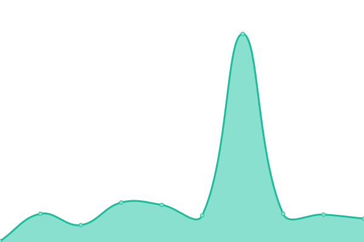
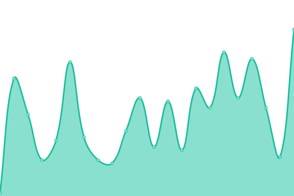
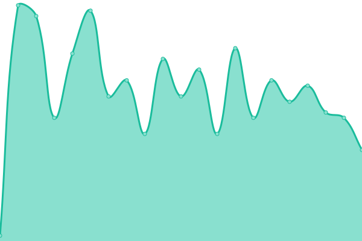
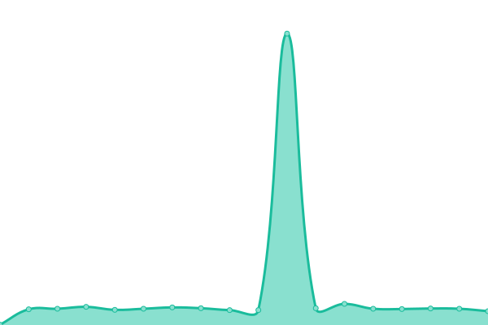
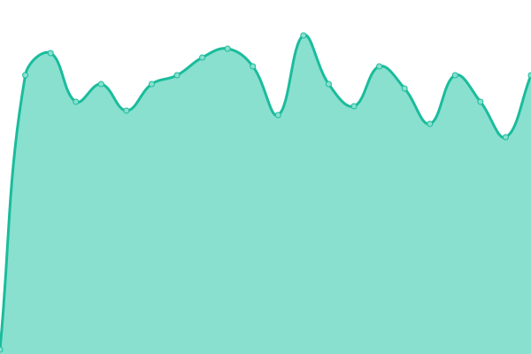
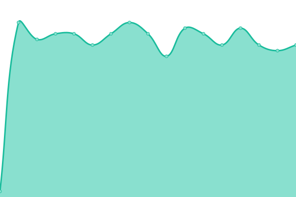

# [📈 Status](https://callruby.github.io/uptime-status): <!--live status--> **🟧 Partial outage**

This repository contains the open-source uptime monitor and status page for [Ruby](http://ruby.com), powered by [Upptime](https://github.com/upptime/upptime).

There is a pipeline set on uptime-status repository that retrieves the files from here , why ? because the endpoints that are tested are private , the self hosted runners are private, but the github page has to be public .

    uptime-status ( is a public repository , this one is the exposed publicly with the status of the url's )

    uptime-status-generator ( is a private repository, where the checks are run using the self hosted runners )

<!--start: status pages-->
<!-- This summary is generated by Upptime (https://github.com/upptime/upptime) -->
<!-- Do not edit this manually, your changes will be overwritten -->
<!-- prettier-ignore -->
| URL | Status | History | Response Time | Uptime |
| --- | ------ | ------- | ------------- | ------ |
|  [ArgoCD](argocd.devops.ruby.com) | 🟩 Up | [argo-cd.yml](https://github.com/callruby/uptime-status-generator/commits/HEAD/history/argo-cd.yml) | 

 33ms
     
 | 

<a href="https://callruby.github.io/uptime-status/history/argo-cd">100.00%</a>
    

|  [Consul](consul.devops.ruby.com) | 🟩 Up | [consul.yml](https://github.com/callruby/uptime-status-generator/commits/HEAD/history/consul.yml) | 

 20ms
     
 | 

<a href="https://callruby.github.io/uptime-status/history/consul">100.00%</a>
    

|  [Vault](vault.devops.ruby.com:8200) | 🟩 Up | [vault.yml](https://github.com/callruby/uptime-status-generator/commits/HEAD/history/vault.yml) | 

 23ms
     
 | 

<a href="https://callruby.github.io/uptime-status/history/vault">100.00%</a>
    

|  [Github-Dashboard](github-dashboard.dev.devops.ruby.com:8080) | 🟩 Up | [github-dashboard.yml](https://github.com/callruby/uptime-status-generator/commits/HEAD/history/github-dashboard.yml) | 

 57ms
     
 | 

<a href="https://callruby.github.io/uptime-status/history/github-dashboard">100.00%</a>
    

|  [Nuget](nuget.callruby.online) | 🟩 Up | [nuget.yml](https://github.com/callruby/uptime-status-generator/commits/HEAD/history/nuget.yml) | 

 57ms
     
 | 

<a href="https://callruby.github.io/uptime-status/history/nuget">100.00%</a>
    

|  [Sonarqube](sonarqube.devops.ruby.com:9000) | 🟩 Up | [sonarqube.yml](https://github.com/callruby/uptime-status-generator/commits/HEAD/history/sonarqube.yml) | 

 21ms
     
 | 

<a href="https://callruby.github.io/uptime-status/history/sonarqube">100.00%</a>
    

|  [Graylog-Qa6](graylog-qa6.dev.devops.ruby.com:9000) | 🟩 Up | [graylog-qa6.yml](https://github.com/callruby/uptime-status-generator/commits/HEAD/history/graylog-qa6.yml) | 

 665ms
     
 | 

<a href="https://callruby.github.io/uptime-status/history/graylog-qa6">99.10%</a>
    

|  [Rabbitmq-Qa6](rabbitmq-qa6.dev.devops.ruby.com:15672) | 🟩 Up | [rabbitmq-qa6.yml](https://github.com/callruby/uptime-status-generator/commits/HEAD/history/rabbitmq-qa6.yml) | 

 1306ms
     
 | 

<a href="https://callruby.github.io/uptime-status/history/rabbitmq-qa6">90.18%</a>
    

|  [Redis-Qa6](redis-qa6.dev.devops.ruby.com) | 🟩 Up | [redis-qa6.yml](https://github.com/callruby/uptime-status-generator/commits/HEAD/history/redis-qa6.yml) | 

 31ms
     
 | 

<a href="https://callruby.github.io/uptime-status/history/redis-qa6">26.17%</a>
    

|  [MsSql-Qa6](mssqldb-master-qa6.dev.devops.ruby.com) | 🟥 Down | [ms-sql-qa6.yml](https://github.com/callruby/uptime-status-generator/commits/HEAD/history/ms-sql-qa6.yml) | 

 29ms
     
 | 

<a href="https://callruby.github.io/uptime-status/history/ms-sql-qa6">67.83%</a>
    

|  [Ros-Qa6-haproxy](qa6ros.dev.devops.ruby.com) | 🟩 Up | [ros-qa6-haproxy.yml](https://github.com/callruby/uptime-status-generator/commits/HEAD/history/ros-qa6-haproxy.yml) | 

 5138ms
     
 | 

<a href="https://callruby.github.io/uptime-status/history/ros-qa6-haproxy">98.62%</a>
    

|  [Prl-Qa6-haproxy](qa6prl.dev.devops.ruby.com) | 🟩 Up | [prl-qa6-haproxy.yml](https://github.com/callruby/uptime-status-generator/commits/HEAD/history/prl-qa6-haproxy.yml) | 

 141ms
     
 | 

<a href="https://callruby.github.io/uptime-status/history/prl-qa6-haproxy">98.96%</a>
    

<!--end: status pages-->

[**Visit our status website →**](https://callruby.github.io/uptime-status)
